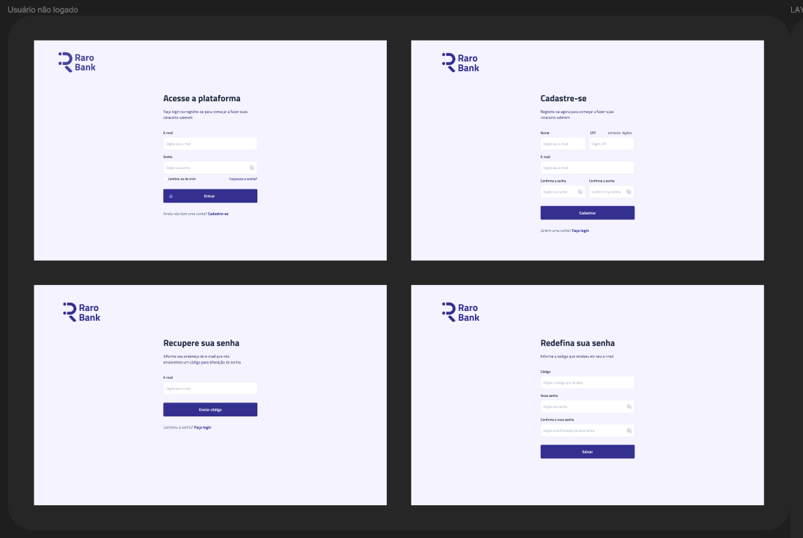
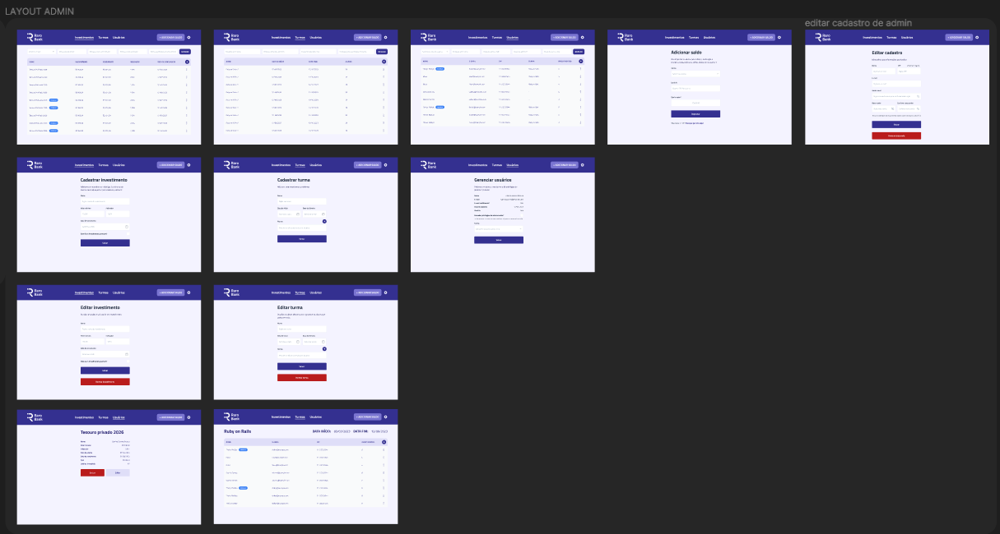
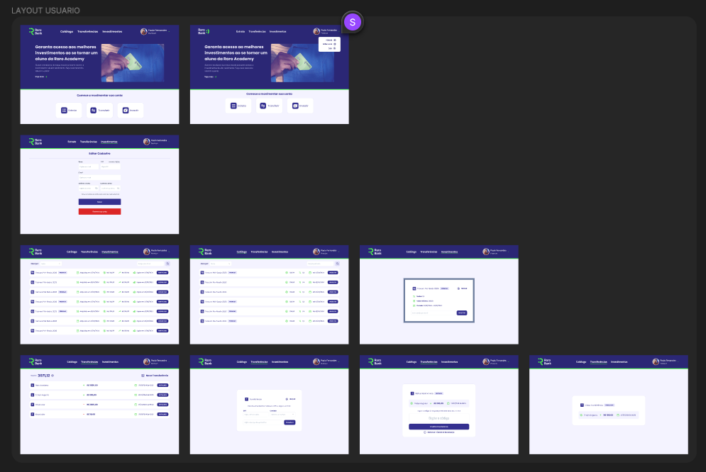

# Protótipos de views do projeto Raro Bank - Grupo 1

Processo de criação de um protótipo de alta fidelidade para o projeto Raro Bank, utilizando a ferramenta Figma:

**LINK:** - [Protótipo de view no Figma](https://www.figma.com/file/9Qh0FAv4BoUbGXp8jrJRqT/RaroBank?type=design&node-id=0-1&t=jmcZAzVcD5TiKnrf-0)

Em cima dos mockups criados, foi feito um protótipo mais detalhado, com as informações e desenhos necessários para a construção das views do projeto.

### Telas de usuários não logados

A aplicação apara usuários logados foi divida em 2 tipos de usuários: administrador e usuários comuns:

### Administrador

### Usuários comuns

